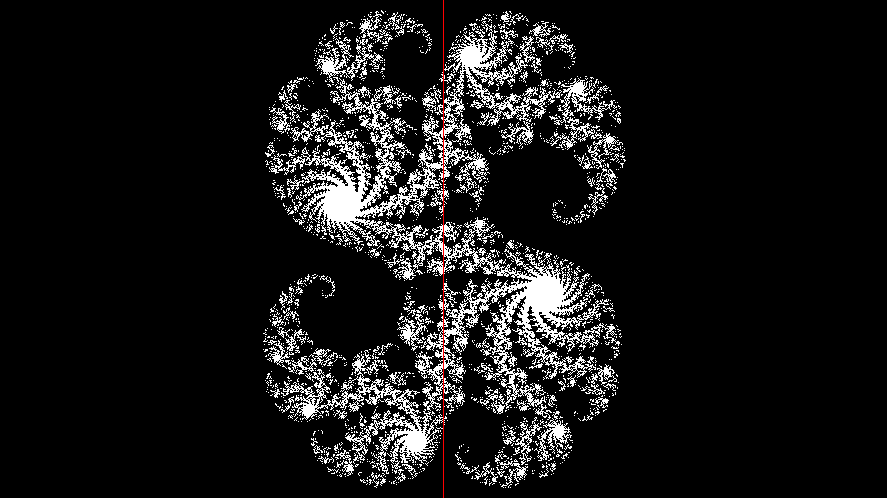

# Fractales

## Description

This repos contains a personnal project created within one week. 
It can generate fractals pictures based on a Julia Set, and explore such a fractal in real time (zoom in and out, go left, right, up and down).
It generates two executables: `FractalesJulia.exe` and `FractalesUI.exe`. The first one creates a picture (.png) of a fractal, and the second one is in real time.

Here is an example of fractals I generated.

The first fractal I generated. The seed of the Julia set is `z² - 3/4`.

An interesting fractal, from the suite `z² + c` with `c = 0.285 + 0.013i`.

## Solution organization

There are currently three projects integrated in the "Fractale" solution:
- FractalesJulia: A starting C# project that generates and saves an image of a fractal.
- FractalesUI: A real time graphical interface for exploring the generated fractals, and (if I continue this project one day) beeing able to change the Julia set. It is implemented in C++, and using SFML.
- CUDAShader: A project implementing code parallelization (executing on NVIDIA GPUs) for the former projects. It is written in CUDA and compiles into a .dll file.

The BuildTools folder contains post-build scripts.

## Execution

These projects require the following settings to run correctely:

- FractalesJulia: needs .NET framework installed. It will run faster if CUDAShader works and compiles properly, but can execute without it anyway.
- FractalesUI: Needs an **NVIDIA GPU** and Cuda installed. The Cuda files must be located at `C:\Program Files\NVIDIA GPU Computing Toolkit\CUDA\v11.8\` (or you'll have to recompile). If your GPU's generation is not an RTX 2080 Ti or higher, you'll have to recompile as well.

## Compilation

Here are requirments for a successful compilation:

- FractalesJulia: needs .NET framework.
- FractalesUI: needs SFML. You can download it [here](https://www.sfml-dev.org/download.php). It goes in the Libraries folder. See the LIBS_README for more informations.
- CUDAShader: Needs an **NVIDIA GPU** and Cuda installed. The Cuda files must be located at `C:\Program Files\NVIDIA GPU Computing Toolkit\CUDA\v11.8\include` (or you'll have to change the compilation configuration of the project). If you don't have an RTX 2080 Ti or higher (supporting sm_75), change the corresponding compilation setting to `compute_52,sm_52` (or less if needed) in the CUDAShader project properties `CUDAShader -> Cuda C/C++ -> Device -> Code Generation`.

I did not try executing this on another OS than Windows. It might work with a few tweaks here and there.
